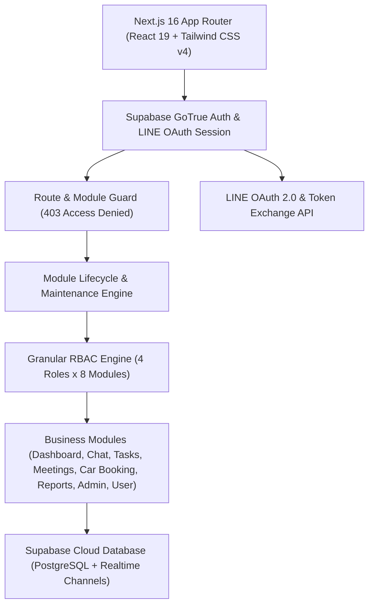

# 🏢 OmniOffice — ระบบออฟฟิศเสมือนสำหรับหน่วยงานภาครัฐและองค์กร (Virtual Office)

ระบบสื่อสาร ทำงานร่วมกัน และบริหารจัดการทรัพยากรภายในองค์กรและหน่วยงานราชการ พัฒนาด้วย **Next.js 16 (App Router)**, **React 19**, **TypeScript** และ **Tailwind CSS v4** เชื่อมต่อฐานข้อมูลคลาวด์สด **Supabase PostgreSQL & Supabase Auth** พร้อมระบบยืนยันตัวตนผ่าน **Google OAuth** และ **LINE Login SSO**, สถาปัตยกรรมการจัดการสิทธิ์ขั้นสูง (**Granular Role-Based Access Control - RBAC**), ระบบบริหารคำขอสิทธิ์เข้าใช้งานใหม่ (Access Requests E-Workflow) และโครงสร้างข้อมูลบุคลากรตามระเบียบงานสารบรรณภาครัฐ

> 🌐 **Production URL:** [https://virtual-office-ten-chi.vercel.app](https://virtual-office-ten-chi.vercel.app)  
> 📖 **คู่มือระบบฉบับสมบูรณ์:** [docs/README.md](file:///c:/Users/GuitarDev/virtual-office/docs/README.md)

---

## 🌟 ภาพรวมระบบและฟีเจอร์เด่น (Key Features)

- 🟢 **Live Supabase Backend & Realtime Synchronization:**
  - เชื่อมต่อโครงการ Supabase Live จริง (`xkeiuyhkokmecefzzynb.supabase.co`) จัดเก็บตาราง `users` และ `access_requests`
  - ระบบ Realtime Subscription (`postgres_changes`) ซิงก์ข้อมูลบุคลากรและคำขอแบบสดผ่าน WebSocket โดยไม่ต้องรีเฟรชหน้าจอ
  - แสดงสถานะเชื่อมต่อสด `🟢 Supabase Live` พร้อมระบบตัดสลับ In-Memory Fallback อัตโนมัติเมื่อออฟไลน์
- 💬 **LINE Login SSO & Google OAuth 2.0 (OpenID Connect):**
  - เข้าสู่ระบบด้วยบัญชี **LINE Account** สีทางการ (`#06C755`) ด้วย OAuth 2.0 / OpenID Connect
  - มี API Route ฝั่งเซิร์ฟเวอร์ [`/api/auth/line/exchange`](file:///c:/Users/GuitarDev/virtual-office/app/api/auth/line/exchange/route.ts) และ [`/api/auth/line/callback`](file:///c:/Users/GuitarDev/virtual-office/app/api/auth/line/callback/route.ts) สำหรับแลกเปลี่ยน Token กับ LINE API อย่างปลอดภัย
  - ระบบซิงก์รูปโปรไฟล์ (Avatar), ชื่อผู้ใช้ และ User ID จาก LINE เข้าสู่ระบบอัตโนมัติ
  - จัดการคำนำหน้าชื่อ (Prefix) อัจฉริยะ: ไม่บันทึก "นาย/นางสาว" โดยอัตโนมัติ เว้นว่างหรือดึงคำนำหน้าจริง และอนุญาตให้ระบุคำนำหน้าทางการ (นาย, นาง, นางสาว, ดร., ว่าที่ ร.ต.) ได้เองในหน้าข้อมูลส่วนตัว
- 🔐 **Supabase Authentication Suite:**
  - เข้าสู่ระบบและลงทะเบียนด้วย Email & Password จริงผ่าน GoTrueClient
  - ระบบกู้คืนและส่งอีเมลรีเซ็ตรหัสผ่าน (`sendPasswordResetEmail`)
  - กลไก **Smart Directory Bypass** สำหรับเจ้าหน้าที่ในทำเนียบข้าราชการเดิม
  - กฎหมายคุ้มครองข้อมูลส่วนบุคคล (PDPA): มีหน้านโยบายความเป็นส่วนตัว [`/policy`](file:///c:/Users/GuitarDev/virtual-office/app/policy/page.tsx) และข้อกำหนดการใช้งาน [`/term`](file:///c:/Users/GuitarDev/virtual-office/app/term/page.tsx)
- 📬 **ระบบจัดการคำขอสิทธิ์เข้าใช้งานใหม่ (Access Requests E-Workflow):**
  - แบบฟอร์มขอสิทธิ์ใช้งานสำหรับบุคคลภายนอก/ข้าราชการบรรจุใหม่บนหน้า Login
  - แท็บ **"คำขอสิทธิ์เข้าใช้งานใหม่"** ในหน้า Admin พร้อมกระดิ่งแจ้งเตือนและ Badge แสดงจำนวนคำขอรอตรวจสอบ
  - ระบบอนุมัติ (Approve) บรรจุเข้าทำเนียบและกำหนด Role ทันที หรือปฏิเสธ (Reject) พร้อมบันทึกเหตุผลและ Audit Log
- 🏛️ **Government Personnel Directory:** โครงสร้างข้อมูลข้าราชการ/เจ้าหน้าที่รัฐครบถ้วน (คำนำหน้า, ชื่อ, นามสกุล, ชื่อเล่น `nickname`, ตำแหน่ง, กลุ่ม/ฝ่าย, อีเมล `@m-society.go.th`, เบอร์โต๊ะทำงาน, Line ID) พร้อมข้อมูลจำลองจากทำเนียบบุคลากรจริงของ **พมจ.กำแพงเพชร**
- 👥 **Full Personnel Management (Admin CRUD):**
  - 👁️ ดูแฟ้มข้อมูลประวัติข้าราชการฉบับสมบูรณ์ (Dossier Modal)
  - ✏️ แก้ไขข้อมูลส่วนบุคคล ตำแหน่ง ฝ่าย และบทบาทสิทธิ์ พร้อมระบบ Dynamic Session Auto-sync
  - 🗑️ ลบบุคลากรพร้อมระบบความปลอดภัย 2 ชั้น: ป้องกันการลบผู้บริหารสูงสุด (`usr_1`) และป้องกันการลบบัญชีตนเองขณะล็อกอิน
  - ➕ ลงทะเบียนบุคลากรใหม่เข้าสู่ระบบ
- 🎛️ **System Module Controls & Maintenance Engine:**
  - สวิตช์เปิด/ปิด แต่ละโมดูลระดับระบบแบบเรียลไทม์
  - หน้าจอ **🚧 ปิดปรับปรุงชั่วคราว (Maintenance Screen)** สำหรับผู้ใช้ทั่วไป พร้อม Badge กำกับบน Sidebar
  - แบนเนอร์ **👑 Admin Bypass Override Mode** ให้ผู้ดูแลระบบเข้าตรวจสอบและกดเปิดใช้งานโมดูลได้ทันที
  - กลไกป้องกันการปิดระบบโมดูล Admin Console
- 🛡️ **Enterprise RBAC & Security:** 4 ระดับบทบาท (Admin 👑, Manager 👔, Member 👤, Guest 🎟️), ตารางเมทริกซ์กำหนดสิทธิ์แบบ Live, ระบบ Route Guard 403 Forbidden และ Security Audit Logs

---

## 🏛️ สถาปัตยกรรมระบบ (System Architecture)



---

## 🗺️ แผนผังการพัฒนาต่อเนื่อง (Roadmap Overview)

| เฟส (Phase) | ชื่อเฟส | รายละเอียดหลัก | สถานะ |
|:---:|---|---|:---:|
| **Phase 1** | Prototyping & Design Foundation | 8 โมดูลหลัก, ดีไซน์โทนสี Indigo/Teal/Slate, ฟอนต์ Kanit/Sarabun | ✅ สมบูรณ์ |
| **Phase 2** | Next.js 16 & Tailwind CSS v4 | สถาปัตยกรรม App Router, React 19, TypeScript, Dark Theme Toggle | ✅ สมบูรณ์ |
| **Phase 3** | Enterprise RBAC System | 4 บทบาทหลัก, ตารางเมทริกซ์สิทธิ์, Role Simulator, Route Guard 403 | ✅ สมบูรณ์ |
| **Phase 4** | Enterprise Auth & Sessions | Split-Screen Login, 1-Click Quick Demo, Session Persistence, Logout Modal | ✅ สมบูรณ์ |
| **Phase 5** | Government Schema & Directory | คำนำหน้า, ชื่อ, นามสกุล, ชื่อเล่น (`nickname`), ฝ่าย, ข้อมูลจริง พมจ.กำแพงเพชร | ✅ สมบูรณ์ |
| **Phase 6** | Admin Personnel CRUD Suite | ดูแฟ้มประวัติ, แก้ไขข้อมูล, ลบสมาชิก, ป้องกันการลบ Root Admin & บัญชีตนเอง | ✅ สมบูรณ์ |
| **Phase 7** | System Module Controls | สลับเปิด/ปิดโมดูลเรียลไทม์, Maintenance Screen, Admin Bypass Override | ✅ สมบูรณ์ |
| **Phase 8** | **Supabase Live Backend & Auth** | เชื่อมต่อ Live Supabase (`xkeiuyhkokmecefzzynb`), GoTrue Auth, Realtime WebSocket | ✅ สมบูรณ์ |
| **Phase 9** | **Access Requests E-Workflow** | ระบบยื่นคำขอสิทธิ์ใช้งานใหม่, แผงพิจารณาอนุมัติ/ปฏิเสธ, Notification Badges | ✅ สมบูรณ์ |
| **Phase 10** | **LINE & Google OAuth 2.0 SSO** | เข้าสู่ระบบด้วย LINE Account (`#06C755`), API Token Exchange, Auto-sync Profile | ✅ สมบูรณ์ |
| **Phase 11** | Digital Car Dispatch & E-Approval | เวิร์กโฟลว์ขออนุมัติรถราชการ 3 ชั้น (ผู้ขอ -> หัวหน้าฝ่าย -> พมจ.), ออกใบขอใช้รถ PDF | 🔜 **ระยะถัดไป (Next Sprint)** |
| **Phase 12** | LINE Official Account & Notify Webhook | ส่งแจ้งเตือนคำขออนุมัติรถราชการ, นัดหมายด่วน และผลอนุมัติผ่าน LINE Messaging API | 📅 แผนระยะต่อไป |
| **Phase 13** | E-Document Management (EDMS) | จัดเก็บหนังสือเวียนและคำสั่งจังหวัดผ่าน Supabase Storage Bucket ที่เข้ารหัส | 📅 แผนระยะยาว |
| **Phase 14** | PWA & Mobile App Companion | Service Worker รองรับออฟไลน์, ติดตั้งลงหน้าจอมือถือ (A2HS), รองรับ Push Notification | 📅 แผนระยะยาว |

---

## 🎯 แผนงานสปรินต์ถัดไป (Next Sprint Priorities)

1. **ระบบขออนุมัติการใช้รถยนต์ราชการแบบ 3 ขั้นตอน (Car Booking E-Approval):**
   - ผู้ใช้งาน (Member) ยื่นคำขอจองรถยนต์ระบุรายละเอียดภารกิจ
   - หัวหน้าฝ่ายบริหารทั่วไป (Manager: นายเสกพล ดิษฐโชติ) ตรวจสอบความพร้อมของรถและพนักงานขับรถ พร้อมลงความเห็นชอบ
   - พมจ.กำแพงเพชร (Admin: นางสาวมะลิวัน สิทธิโยธี) ลงนามอนุมัติขั้นสุดท้าย พร้อมออกเอกสารขอใช้รถยนต์ราชการอิเล็กทรอนิกส์ (PDF Export)
2. **ระบบส่งการแจ้งเตือนผลอนุมัติเข้า LINE Messaging API:**
   - เชื่อมต่อ `LINE_CHANNEL_ACCESS_TOKEN` เพื่อ Push ข้อความแจ้งเตือนผลการอนุมัติรถยนต์และนัดหมายตรงเข้า LINE ของผู้ขอใช้งาน

---

## 🚀 การติดตั้งและเริ่มใช้งาน

```bash
# 1. ติดตั้ง dependencies
npm install

# 2. ตั้งค่าสภาพแวดล้อม (.env.local)
cp .env.example .env.local

# 3. รันระบบในโหมดพัฒนา
npm run dev

# 4. เข้าใช้งานผ่านเบราว์เซอร์
# http://localhost:3000
```

---

## 🧪 การตรวจสอบคุณภาพโค้ด (Quality Assurance)

```bash
# ตรวจสอบ TypeScript Type Checking แบบ Strict
npx tsc --noEmit

# ทดสอบคอมไพล์ Production Bundle
npm run build
```

*สถานะการทดสอบ:* ผ่านการตรวจสอบ Type Check 100% (0 errors), Build Production สำเร็จใน < 1 วินาที และผ่านการทดสอบ User Flows อัตโนมัติด้วย Playwright

---

## 👤 คณะผู้ดูแลโครงการ

- 💻 **Lead Developer:** GuitarDev
- 🏛️ **หน่วยงานต้นแบบ:** สำนักงานพัฒนาสังคมและความมั่นคงของมนุษย์จังหวัดกำแพงเพชร (พมจ.กำแพงเพชร)
- 🔒 **มาตรฐาน:** Enterprise Role-Based Access Control & Government Electronic Workflow
- 🌐 **Deploy Production:** [https://virtual-office-ten-chi.vercel.app](https://virtual-office-ten-chi.vercel.app)
- 📖 **เอกสารฉบับสมบูรณ์:** [docs/README.md](file:///c:/Users/GuitarDev/virtual-office/docs/README.md)
