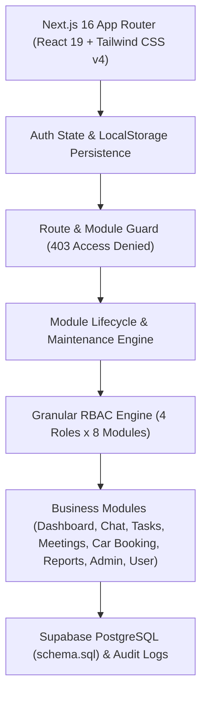

# 🏢 OmniOffice — ระบบออฟฟิศเสมือนสำหรับหน่วยงานภาครัฐและองค์กร (Virtual Office)

ระบบสื่อสาร ทำงานร่วมกัน และบริหารจัดการทรัพยากรภายในองค์กรและหน่วยงานราชการ พัฒนาด้วย **Next.js 16 (App Router)**, **React 19**, **TypeScript** และ **Tailwind CSS v4** พร้อมสถาปัตยกรรมการจัดการสิทธิ์ขั้นสูง (**Granular Role-Based Access Control - RBAC**), ระบบควบคุมวงจรชีวิตโมดูล (Module Lifecycle Management) และโครงสร้างข้อมูลบุคลากรตามระเบียบงานสารบรรณภาครัฐ

> 📖 สำหรับเอกสารฉบับเต็มและคู่มือระบบโดยละเอียด โปรดดูที่ [docs/README.md](file:///c:/Users/GuitarDev/virtual-office/docs/README.md)

---

## 🌟 ภาพรวมระบบและฟีเจอร์เด่น (Key Features)

- 🏛️ **Government Personnel Directory:** โครงสร้างข้อมูลข้าราชการ/เจ้าหน้าที่รัฐครบถ้วน (คำนำหน้า, ชื่อ, นามสกุล, ชื่อเล่น `nickname`, ตำแหน่ง, กลุ่ม/ฝ่าย, อีเมล `@m-society.go.th`, เบอร์โต๊ะทำงาน, Line ID) พร้อมข้อมูลจำลองจากทำเนียบบุคลากรจริงของ **พมจ.กำแพงเพชร**
- 👥 **Full Personnel Management (Admin CRUD):**
  - 👁️ ดูแฟ้มข้อมูลประวัติข้าราชการฉบับสมบูรณ์ (Dossier Modal)
  - ✏️ แก้ไขข้อมูลส่วนบุคคล ตำแหน่ง ฝ่าย และบทบาทสิทธิ์ พร้อมระบบ Dynamic Session Auto-sync
  - 🗑️ ลบบุคลากรพร้อมระบบความปลอดภัย 2 ชั้น: ป้องกันการลบผู้บริหารสูงสุด (`usr_1`) และป้องกันการลบบัญชีตนเองขณะล็อกอิน
  - ➕ ลงทะเบียนบุคลากรใหม่เข้าสู่ระบบ
- 🎛️ **System Module Controls & Maintenance Engine:**
  - สวิตช์เปิด/ปิด แต่ละโมดูลระดับระบบแบบเรียลไทม์
  - หน้าจอ **🚧 ปิดปรับปรุงชั่วคราว (Maintenance Screen)** สำหรับผู้ใช้ทั่วไป พร้อม Badge กำกับบน Sidebar
  - แบนเนอร์ **👑 Admin Bypass Override Mode** ให้ผู้ดูแลระบบเข้าตรวจสอบและกดเปิดใช้งานโมดูลได้ทันที
  - กลไกป้องกันการปิดระบบโมดูล Admin Console
- 🛡️ **Enterprise RBAC & Security:** 4 ระดับบทบาท (Admin 👑, Manager 👔, Member 👤, Guest 🎟️), ตารางเมทริกซ์กำหนดสิทธิ์แบบ Live, ระบบ Route Guard 403 Forbidden และ Security Audit Logs
- 🔐 **Authentication & Sessions:** หน้าล็อกอินแบบ Split Screen สไตล์องค์กร, ปุ่ม Quick Demo 1-Click Login, บันทึกเซสชันลง LocalStorage และ Logout Confirmation Modal
- 🚗 **Car Booking & Official Travel:** ระบบจองยานพาหนะราชการและการเตรียมพร้อมสู่อิเล็กทรอนิกส์เวิร์กโฟลว์ 3 ลำดับขั้น

---

## 🏛️ สถาปัตยกรรมระบบ (System Architecture)



---

## 🗺️ แผนผังการพัฒนาต่อเนื่อง (Roadmap Overview)

| เฟส (Phase) | ชื่อเฟส | รายละเอียดหลัก | สถานะ |
|:---:|---|---|:---:|
| **Phase 1** | Prototyping & Design Foundation | 8 โมดูลหลัก, ดีไซน์โทนสี Indigo/Teal/Slate, ฟอนต์ Kanit/Sarabun | ✅ สมบูรณ์ |
| **Phase 2** | Next.js 16 & Tailwind CSS v4 | สถาปัตยกรรม App Router, React 19, TypeScript, Dark Theme Toggle | ✅ สมบูรณ์ |
| **Phase 3** | Enterprise RBAC System | 4 บทบาทหลัก, ตารางเมทริกซ์สิทธิ์, Role Simulator, Route Guard 403 | ✅ สมบูรณ์ |
| **Phase 4** | Enterprise Auth & Sessions | Split-Screen Login, 1-Click Quick Demo, Session Persistence, Logout Modal | ✅ สมบูรณ์ |
| **Phase 5** | Government Schema & Directory | คำนำหน้า, ชื่อ, นามสกุล, ชื่อเล่น (`nickname`), ฝ่าย, ข้อมูลจริง พมจ.กำแพงเพชร | ✅ สมบูรณ์ |
| **Phase 6** | Admin Personnel CRUD Suite | ดูแฟ้มประวัติ, แก้ไขข้อมูล, ลบสมาชิก, ป้องกันการลบ Root Admin & บัญชีตนเอง | ✅ สมบูรณ์ |
| **Phase 7** | System Module Controls | สลับเปิด/ปิดโมดูลเรียลไทม์, Maintenance Screen, Admin Bypass Override | ✅ สมบูรณ์ |
| **Phase 8** | **Supabase Production Backend & Auth** | ย้ายจาก In-Memory สู่ Supabase PostgreSQL, Authentication, RLS Policies | 🔜 **ระยะถัดไป (Next Sprint)** |
| **Phase 9** | Realtime Chat & Kanban Synchronization | Supabase Realtime Channels (WebSocket), การ์ด Kanban แบบสด, ตัวบอกสถานะออนไลน์ | 📅 แผนระยะต่อไป |
| **Phase 10** | Digital Car Dispatch & E-Approval | เวิร์กโฟลว์ขออนุมัติรถราชการ 3 ชั้น (ผู้ขอ -> หัวหน้าฝ่าย -> พมจ.), ออกใบขอใช้รถ PDF | 📅 แผนระยะต่อไป |
| **Phase 11** | LINE Official Account & Notify Webhook | ส่งแจ้งเตือนคำขออนุมัติรถราชการ, นัดหมายด่วน และผลอนุมัติผ่าน LINE Messaging API | 📅 แผนระยะต่อไป |
| **Phase 12** | E-Document Management (EDMS) | จัดเก็บหนังสือเวียนและคำสั่งจังหวัดผ่าน Supabase Storage Bucket ที่เข้ารหัส | 📅 แผนระยะยาว |
| **Phase 13** | PWA & Mobile App Companion | Service Worker รองรับออฟไลน์, ติดตั้งลงหน้าจอมือถือ (A2HS), รองรับ Push Notification | 📅 แผนระยะยาว |

---

## 🎯 แผนงานสปรินต์ถัดไป (Next Sprint Priorities)

1. **การเชื่อมต่อ Backend Supabase สมบูรณ์:**
   - ใช้งานตาราง `public.members` จาก [supabase/schema.sql](file:///c:/Users/GuitarDev/virtual-office/supabase/schema.sql)
   - ดำเนินการ Data Seeding รายชื่อข้าราชการ พมจ.กำแพงเพชร เข้าสู่ฐานข้อมูล Supabase
   - เปิดใช้งาน Row-Level Security (RLS) ตรวจสอบสิทธิ์ผ่าน JWT Role
2. **ระบบขออนุมัติการใช้รถยนต์ราชการแบบ 3 ขั้นตอน (Car Booking E-Approval):**
   - ผู้ใช้งาน (Member) ยื่นคำขอจองรถยนต์
   - หัวหน้าฝ่ายบริหารทั่วไป (Manager: นายเสกพล ดิษฐโชติ) ตรวจสอบและให้ความเห็นชอบ
   - พมจ.กำแพงเพชร (Admin: นางสาวมะลิวัน สิทธิโยธี) ลงนามอนุมัติขั้นสุดท้าย พร้อมออกเอกสารขอใช้รถยนต์ราชการอิเล็กทรอนิกส์
3. **ระบบแจ้งเตือน Line Official Account / Line Notify:**
   - นำฟิลด์ `lineId` ของสมาชิกเชื่อมกับ LINE Messaging API เพื่อส่งแจ้งเตือนงานด่วนและผลการอนุมัติรถยนต์

---

## 🚀 การติดตั้งและเริ่มใช้งาน

```bash
# ติดตั้ง dependencies
npm install

# รันระบบในโหมดพัฒนา
npm run dev

# เข้าใช้งานผ่านเบราว์เซอร์
# http://localhost:3000
```

---

## 🧪 การตรวจสอบคุณภาพโค้ด (Quality Assurance)

```bash
# ตรวจสอบ TypeScript Type Checking แบบ Strict
npx tsc --noEmit
```

*สถานะการทดสอบ:* ผ่านการตรวจสอบ Type Check 100% (0 errors) พร้อมผ่านการทดสอบ User Flows อัตโนมัติด้วย Playwright

---

## 👤 คณะผู้ดูแลโครงการ

- 💻 **Lead Developer:** GuitarDev
- 🏛️ **หน่วยงานต้นแบบ:** สำนักงานพัฒนาสังคมและความมั่นคงของมนุษย์จังหวัดกำแพงเพชร (พมจ.กำแพงเพชร)
- 🔒 **มาตรฐาน:** Enterprise Role-Based Access Control & Government Electronic Workflow
- 📖 **เอกสารฉบับสมบูรณ์:** [docs/README.md](file:///c:/Users/GuitarDev/virtual-office/docs/README.md)
