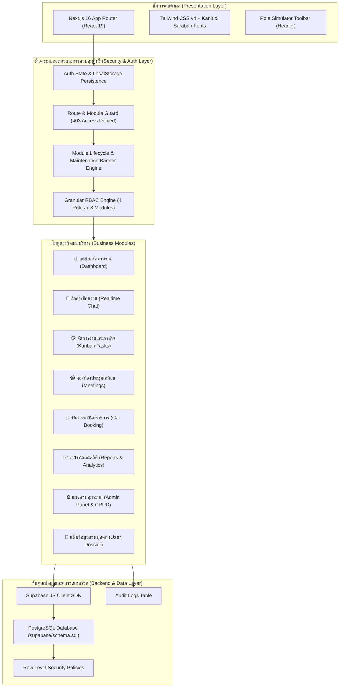

# 🏢 OmniOffice — ระบบออฟฟิศเสมือนสำหรับหน่วยงานภาครัฐและองค์กร (Virtual Office)

ระบบสื่อสาร ทำงานร่วมกัน และบริหารจัดการทรัพยากรภายในองค์กรและหน่วยงานราชการ พัฒนาด้วย **Next.js 16 (App Router)**, **React 19**, **TypeScript** และ **Tailwind CSS v4** พร้อมสถาปัตยกรรมการจัดการสิทธิ์ขั้นสูง (**Granular Role-Based Access Control - RBAC**), ระบบควบคุมวงจรชีวิตโมดูล (Module Lifecycle Management) และโครงสร้างข้อมูลบุคลากรตามระเบียบงานสารบรรณภาครัฐ

---

## 📑 สารบัญ (Table of Contents)
1. [ภาพรวมของระบบและจุดเด่น](#-ภาพรวมของระบบและจุดเด่น-key-highlights)
2. [สถาปัตยกรรมระบบ (System Architecture)](#-สถาปัตยกรรมระบบ-system-architecture)
3. [โครงสร้างโปรเจกต์ (Project Structure)](#-โครงสร้างโปรเจกต์-project-structure)
4. [Design System & UI Guidelines](#-design-system--ui-guidelines)
5. [ระบบจัดการสิทธิ์และการเข้าถึง (Enterprise RBAC)](#-ระบบจัดการสิทธิ์และการเข้าถึง-enterprise-rbac)
6. [ระบบบริหารจัดการบุคลากร (Personnel Management Suite)](#-ระบบบริหารจัดการบุคลากร-personnel-management-suite)
7. [ระบบควบคุมและเปิด/ปิดโมดูลระบบ (System Module Controls)](#-ระบบควบคุมและเปิดปิดโมดูลระบบ-system-module-controls)
8. [ระบบยืนยันตัวตนและเซสชัน (Authentication & Sessions)](#-ระบบยืนยันตัวตนและเซสชัน-authentication--sessions)
9. [โครงสร้างข้อมูลบุคลากรภาครัฐ & ทำเนียบจริง (พมจ.กำแพงเพชร)](#-โครงสร้างข้อมูลบุคลากรภาครัฐ--ทำเนียบจริง-พมจกำแพงเพชร)
10. [ฐานข้อมูลและสกีมา (Database & Supabase Integration)](#-ฐานข้อมูลและสกีมา-database--supabase-integration)
11. [แผนผังการพัฒนาต่อเนื่อง (Comprehensive Roadmap - 13 Phases)](#-แผนผังการพัฒนาต่อเนื่อง-comprehensive-roadmap---13-phases)
12. [แผนงานสปรินต์ถัดไป (Next Sprint Action Items)](#-แผนงานสปรินต์ถัดไป-next-sprint-action-items)
13. [การติดตั้งและเริ่มใช้งาน (Getting Started)](#-การติดตั้งและเริ่มใช้งาน-getting-started)
14. [การทดสอบและการตรวจสอบคุณภาพ (Testing & QA Guide)](#-การทดสอบและการตรวจสอบคุณภาพ-testing--qa-guide)
15. [ประวัติการปรับปรุง (Changelog & Version History)](#-ประวัติการปรับปรุง-changelog--version-history)

---

## 🌟 ภาพรวมของระบบและจุดเด่น (Key Highlights)

OmniOffice ได้รับการออกแบบขึ้นเพื่อตอบสนองต่อการทำงานยุคดิจิทัลของหน่วยงานภาครัฐ โดยจำลองสภาพแวดล้อมสำนักงานเสมือน (Virtual Workplace) รวมทั้งโมดูลสื่อสาร งานโครงการ การประชุม และการบริหารยานพาหนะราชการเข้าไว้ในที่เดียว:

- 🏛️ **Government-Tailored Schema:** โครงสร้างข้อมูลสอดคล้องกับระเบียบข้าราชการไทย มีคำนำหน้า ชื่อ นามสกุล ชื่อเล่น (`nickname`) ตำแหน่ง กลุ่ม/ฝ่าย เบอร์โต๊ะทำงาน และ Line ID
- 👥 **Real Personnel Dataset:** ข้อมูลตั้งต้นอ้างอิงจากทำเนียบบุคลากรจริงของ **สำนักงานพัฒนาสังคมและความมั่นคงของมนุษย์จังหวัดกำแพงเพชร (พมจ.กำแพงเพชร)**
- 👑 **Dual-Layer Admin Security:** ระบบป้องกันความปลอดภัยของบัญชีผู้ดูแลระบบ ห้ามลบบัญชีผู้บริหารสูงสุด (`usr_1`) และห้ามผู้ดูแลระบบลบบัญชีตนเองขณะใช้งาน
- 🎛️ **Live Module Toggling & Maintenance Mode:** สวิตช์ควบคุมเปิด/ปิดแต่ละโมดูลได้แบบเรียลไทม์ พร้อมหน้าจอแจ้งเตือนปรับปรุงระบบ (Maintenance Screen) และ Admin Bypass Override
- 🔐 **Zero-Friction Role Simulator & Real Auth:** สลับสิทธิ์ทดสอบมุมมอง Admin, Manager, Member, Guest ได้ในคลิกเดียว พร้อมหน้าล็อกอินองค์กรและบันทึกเซสชันคงทน
- 🚀 **Cutting-Edge Tech Stack:** ขับเคลื่อนด้วย Next.js 16, React 19, Tailwind CSS v4 และรองรับ Supabase PostgreSQL อย่างสมบูรณ์

---

## 🏛️ สถาปัตยกรรมระบบ (System Architecture)



---

## 📁 โครงสร้างโปรเจกต์ (Project Structure)

```
virtual-office/
├── app/
│   ├── favicon.ico                 # ไอคอนของเว็บแอปพลิเคชัน
│   ├── globals.css                 # Tailwind CSS v4 imports, CSS Variables & Typography
│   ├── layout.tsx                  # Root Layout พร้อม Metadata และ Google Fonts (Kanit & Sarabun)
│   └── page.tsx                    # แดชบอร์ดหลักและศูนย์กลางโมดูลทั้งหมด (App Router SPA)
├── components/
│   └── auth/
│       ├── LoginPage.tsx           # หน้าจอเข้าสู่ระบบระดับองค์กร (Enterprise Split-Screen Login)
│       └── LogoutConfirmModal.tsx     # หน้าต่างยืนยันการออกจากระบบพร้อมสถานะความปลอดภัย
├── lib/
│   ├── rbac.ts                     # เมทริกซ์สิทธิ์ RBAC, ชุดข้อมูลทำเนียบจริง พมจ., ข้อมูลโมดูลระบบ
│   ├── supabase.ts                 # Supabase Client Configuration & Initialization
│   └── types.ts                    # TypeScript Interfaces (Member, Role, ModuleId, SystemModule ฯลฯ)
├── supabase/
│   └── schema.sql                  # PostgreSQL Schema DDL, ตารางสมาชิก สิทธิ์ และ Row Level Security (RLS)
├── docs/
│   └── README.md                   # เอกสารประกอบระบบ คู่มือการใช้งาน และ Roadmap ฉบับสมบูรณ์
├── README.md                       # เอกสารสรุปโครงการหลัก (Root Reference)
├── next.config.js                  # การกำหนดค่า Next.js
├── package.json                    # รายการไลบรารี Dependencies และ NPM Scripts
└── tsconfig.json                   # การกำหนดค่า TypeScript Strict Checking
```

---

## 🎨 Design System & UI Guidelines

| หมวดหมู่ | ค่ากำหนด / ตัวแปร | รายละเอียดการใช้งาน |
|---|---|---|
| **Primary Color** | `#4F46E5` (Indigo-600) | สีหลักประจำแบรนด์, ปุ่ม Action หลัก, Active State, Header Highlights |
| **Secondary Color** | `#0D9488` (Teal-600) | สีย่อยสำหรับงานภารกิจ, สถานะความสำเร็จ, งานบริการ |
| **Accent Color** | `#F59E0B` (Amber-500) | สีเตือนความจำ, งานด่วนเร่งรัด, แจ้งเตือนบำรุงรักษาระบบ |
| **Neutral Background**| `#F8FAFC` (Slate-50) | สีพื้นหลังหลักของระบบ ให้ความรู้สึกสบายตา สไตล์สำนักงานโมเดิร์น |
| **Surface Cards** | `#FFFFFF` (White) / Border `#E2E8F0` | บัตรเนื้อหา การ์ดโมดูล ตารางข้อมูล มีขอบมนคมชัด |
| **Text Primary** | `#0F172A` (Slate-900) | สีตัวอักษรเนื้อหาหลัก คมชัด อ่านง่าย |
| **Text Muted** | `#64748B` (Slate-500) | สีข้อความอธิบายย่อย และป้ายระบุข้อมูลกำกับ |
| **Typography (Headings)**| `Kanit`, sans-serif (น้ำหนัก 500/600/700) | ฟอนต์หัวเรื่องสไตล์โมเดิร์น ทันสมัย เหมาะกับภาษาไทย |
| **Typography (Body)**| `Sarabun`, sans-serif (น้ำหนัก 300/400/500) | ฟอนต์เนื้อหาทางการ อ่านสบายตา ตามมาตรฐานหนังสือราชการ |
| **Border Radius** | `rounded-xl` (12px), `rounded-2xl` (16px) | ขอบมนระดับพรีเมียม สอดคล้องกับมาตรฐาน UI ปี 2026 |

---

## 🛡️ ระบบจัดการสิทธิ์และการเข้าถึง (Enterprise RBAC)

ระบบกำหนดสิทธิ์การเข้าถึงระดับองค์กรแบ่งออกเป็น 4 ระดับบทบาทหลัก:

| บทบาท (Role) | สัญลักษณ์ | คำอธิบายสิทธิ์ | สิทธิ์การเข้าถึงโมดูลตามค่าเริ่มต้น |
|---|:---:|---|---|
| **ผู้ดูแลระบบ (Admin)** | 👑 | มีสิทธิ์สูงสุดในระบบ ดูแลสมาชิก เปิด/ปิดโมดูล แก้ไขสิทธิ์ และตรวจสอบ Audit Logs | Dashboard, Chat, Tasks, Meetings, Car Booking, Reports, Admin Panel, Profile |
| **ผู้จัดการ (Manager)** | 👔 | บริหารจัดการกลุ่ม/ฝ่าย ติดตามงาน อนุมัติการใช้ยานพาหนะ ตรวจสอบรายงาน | Dashboard, Chat, Tasks, Meetings, Car Booking, Reports, Profile |
| **พนักงาน/เจ้าหน้าที่ (Member)** | 👤 | ปฏิบัติงานประจำ ส่งงาน จองรถยนต์ราชการ เข้าร่วมประชุม สื่อสารในทีม | Dashboard, Chat, Tasks, Meetings, Car Booking, Profile |
| **ผู้มาติดต่อ/ที่ปรึกษา (Guest)** | 🎟️ | เข้าถึงเฉพาะห้องประชุมที่ได้รับเชิญและห้องสื่อสารสาธารณะ | Chat, Meetings, Profile |

### ฟังก์ชันหลักของระบบ RBAC:
1. **Interactive Role Simulator (Header):** แถบจำลองบทบาทด้านบนให้ผู้ทดสอบระบบสามารถคลิกเปลี่ยนสิทธิ์ระหว่าง Admin / Manager / Member / Guest ได้ทันทีโดยไม่ต้องล็อกอินใหม่
2. **Granular RBAC Matrix Table (Admin Console):** ตารางเมทริกซ์ 8 โมดูล x 4 บทบาท สามารถติ๊กเปิด/ปิดสิทธิ์ของแต่ละบทบาทได้แบบเรียลไทม์ และระบบจะแสดงผลการล็อกเมนูบน Sidebar ทันที
3. **Route & Module Guard (403 Access Denied):** หากผู้ใช้พยายามเข้าถึงโมดูลที่ไม่มีสิทธิ์ผ่านการกด URL หรือจำลองสิทธิ์ ระบบจะแสดงหน้าจอแจ้งเตือน `🚫 สิทธิ์การเข้าถึงไม่เพียงพอ (Access Denied - 403 Forbidden)` อย่างปลอดภัย
4. **Security Audit Logger:** ระบบบันทึกการกระทำสำคัญทุกรายการ (Login, Logout, Role Switch, Edit Member, Toggle Module, Grant/Revoke Permission) พร้อมตราประทับเวลาและผู้กระทำ

---

## 👥 ระบบบริหารจัดการบุคลากร (Personnel Management Suite)

สำหรับผู้มีสิทธิ์ระดับ **ผู้ดูแลระบบ (Admin)** ระบบจัดเตรียมเครื่องมือบริหารจัดการบุคลากรภาครัฐแบบ Full CRUD ครบถ้วน:

```
┌────────────────────────────────────────────────────────────────────────┐
│                        ADMIN PERSONNEL CONSOLE                         │
├────────────────────────────────────────────────────────────────────────┤
│  [➕ เพิ่มบุคลากรใหม่]    ค้นหาบุคลากร: [ 🔍 นายเสกพล... ]  (รวม 8 รายการ)│
│                                                                        │
│  รูป   ชื่อ-สกุล (ชื่อเล่น)      ตำแหน่ง / ฝ่าย          บทบาท    การดำเนินการ │
│  ───   ───────────────────     ────────────────────    ─────    ──────────── │
│  [👤]  น.ส.มะลิวัน สิทธิโยธี    พมจ.กำแพงเพชร          [Admin]  👁️ ✏️ 🔒     │
│  [👤]  นายเสกพล ดิษฐโชติ (เสก) นักพัฒนาสังคมชำนาญการ   [Manager]👁️ ✏️ 🗑️    │
│  [👤]  น.ส.ขวัญนภา ศิริสมบัติ   จนท.ระบบคอมพิวเตอร์     [Member] 👁️ ✏️ 🗑️    │
└────────────────────────────────────────────────────────────────────────┘
```

### รายละเอียดฟังก์ชัน CRUD:
1. 👁️ **แฟ้มข้อมูลบุคลากรภาครัฐฉบับสมบูรณ์ (View Member Dossier Modal):**
   - แสดงบัตรประจำตัวข้าราชการ รูปถ่าย ตราตำแหน่ง
   - แสดงกลุ่ม/ฝ่าย, อีเมลราชการ, หมายเลขโทรศัพท์โต๊ะทำงาน, Line ID
   - แสดงสถานะการปฏิบัติงาน (Active / Inactive) และบทบาทสิทธิ์
   - แสดงรายการโมดูลทั้งหมดที่บุคลากรผู้นั้นได้รับอนุญาตให้เข้าใช้งานได้
2. ✏️ **แก้ไขข้อมูลและปรับบทบาทสิทธิ์ (Edit Member Modal):**
   - แก้ไขคำนำหน้านาม, ชื่อจริง, นามสกุล, ชื่อเล่น (`nickname`)
   - ปรับเปลี่ยนตำแหน่งสายงานและกลุ่ม/ฝ่ายปฏิบัติงาน
   - แก้ไขอีเมล, เบอร์โทรศัพท์, Line ID
   - ปรับระดับบทบาทสิทธิ์ (Admin / Manager / Member / Guest)
   - ปรับสถานะการปฏิบัติราชการ (ปฏิบัติงานปกติ / ระงับการใช้งานชั่วคราว)
   - ⚡ **Dynamic Session Synchronization:** หากผู้ดูแลระบบแก้ไขข้อมูลของตนเองที่ล็อกอินอยู่ ระบบจะอัปเดต `currentUser`, `currentUserRole` และ `localStorage` ทันทีแบบไร้รอยต่อ
3. 🗑️ **ลบบุคลากรออกจากระบบ (Delete Member Modal):**
   - แสดงหน้าต่างเตือนสีแดงพร้อมระบุชื่อและตำแหน่งบุคลากรที่จะลบ
   - 🛡️ **Protected Root Administrator Safeguard:** ระบบป้องกันไม่ให้ลบบัญชีผู้บริหารสูงสุด (`usr_1`: นางสาวมะลิวัน สิทธิโยธี) เพื่อรักษาความต่อเนื่องของระบบ
   - 🔒 **Self-Deletion Prevention Safeguard:** ระบบป้องกันไม่ให้ผู้ดูแลระบบที่กำลังล็อกอินอยู่ลบบัญชีของตนเอง เพื่อป้องกันปัญหาระบบล็อกตัวเองออก
4. ➕ **ลงทะเบียนบุคลากรใหม่ (Add New Personnel):**
   - แบบฟอร์มเพิ่มข้าราชการ/เจ้าหน้าที่ใหม่เข้าสู่ระบบ พร้อมกำหนดกลุ่ม/ฝ่าย และสิทธิ์การใช้งาน

---

## 🎛️ ระบบควบคุมและเปิด/ปิดโมดูลระบบ (System Module Controls)

ผู้ดูแลระบบสามารถควบคุมการทำงานของแต่ละโมดูลในระบบ OmniOffice ได้อย่างอิสระ:

### 1. สวิตช์เปิด/ปิดโมดูลระดับระบบ (System-wide Module Toggling)
- สลับสถานะเปิดใช้งาน (**Active**) หรือปิดปรับปรุง (**Maintenance**) ของทั้ง 8 โมดูลได้ในคลิกเดียว
- บันทึกการเปลี่ยนแปลงลงใน Audit Logs อัตโนมัติ
- 🛡️ **Admin Module Safeguard:** ล็อกการปิดระบบของโมดูล Admin Panel เพื่อป้องกันไม่ให้ผู้ดูแลระบบปิดประตูควบคุมของตนเอง

### 2. แก้ไขข้อมูลและข้อความประกาศโมดูล (Edit Module Settings)
- ปรับแต่งชื่อโมดูล (Module Title)
- เปลี่ยนสัญลักษณ์ไอคอน (Emoji Icon)
- แก้ไขคำอธิบายหน้าที่ของโมดูล
- กำหนดข้อความแจ้งประกาศปิดปรับปรุงเฉพาะโมดูล (**Custom Maintenance Notice**)

### 3. ประสบการณ์การใช้งานในโหมดปิดปรับปรุง (Maintenance Experience)
- **ผู้ใช้งานทั่วไป (Member / Manager / Guest):**
  - แสดงป้ายกำกับ `ปิดปรับปรุง` สีส้มบน Sidebar
  - หากคลิกเข้าหน้า จะแสดงหน้าจอ **🚧 โมดูลปิดปรับปรุงชั่วคราว (System Maintenance Screen)** พร้อมไอคอนรูปประแจ ข้อความประกาศจากผู้ดูแลระบบ และปุ่มย้อนกลับหน้าแดชบอร์ด
- **ผู้ดูแลระบบ (Admin Bypass Override):**
  - ผู้ดูแลระบบยังคงสามารถคลิกเข้าใช้งานโมดูลที่ปิดปรับปรุงเพื่อตรวจสอบและทดสอบระบบได้
  - แสดงแบนเนอร์สีเหลืองเตือนด้านบน **⚠️ โมดูลนี้กำลังปิดปรับปรุงชั่วคราว (Admin Bypass Mode)** พร้อมปุ่ม **🟢 เปิดใช้งานโมดูลทันที**

---

## 🔐 ระบบยืนยันตัวตนและเซสชัน (Authentication & Sessions)

1. **Enterprise Split-Screen Login Page (`components/auth/LoginPage.tsx`):**
   - ดีไซน์แบ่งครึ่งหน้าจอ (Split Screen) ด้านซ้ายเป็น Hero Showcase องค์กร ด้านขวาเป็นฟอร์มเข้าสู่ระบบ
   - รองรับการกรอกอีเมลและรหัสผ่านจริง พร้อมปุ่มเปิด/ปิดตาดูรหัสผ่าน (👁️ Toggle Password)
   - การ์ด **Quick Demo Accounts (1-Click Login):** เข้าใช้งานด่วนด้วย 4 บทบาทหลัก แสดงรูปและชื่อข้าราชการจริง
   - ปุ่มเติมข้อมูลด่วน (✍️ Auto-fill Credentials)
   - หน้าต่าง **ลืมรหัสผ่าน (Forgot Password Modal)**
   - หน้าต่าง **ขอสิทธิ์เข้าใช้งานใหม่ (Request Access Modal)** รองรับเลือกกลุ่ม/ฝ่ายจริง
2. **Session Persistence (LocalStorage):**
   - บันทึกสถานะผู้ใช้งานใน `omnioffice_auth_session`
   - กู้คืนสถานะอัตโนมัติเมื่อเปิดเว็บใหม่หรือกด Refresh
   - มีกลไกป้องกัน SSR Hydration Mismatch
3. **Logout Confirmation Dialog (`components/auth/LogoutConfirmModal.tsx`):**
   - โมดัลยืนยันก่อนออกจากระบบ ป้องกันการคลิกพลาด
   - มีจุดทริกเกอร์ออกจากระบบ 3 จุด: Header Profile Popover, Sidebar Bottom Bar, User Profile Tab

---

## 🏛️ โครงสร้างข้อมูลบุคลากรภาครัฐ & ทำเนียบจริง (พมจ.กำแพงเพชร)

### ข้อกำหนดฟิลด์ข้อมูลตามระเบียบราชการไทย:
```typescript
interface Member {
  id: string;
  prefix: string;        // คำนำหน้านาม (นาย / นาง / นางสาว / ดร. / ว่าที่ ร.ต.)
  firstName: string;     // ชื่อตัว
  lastName: string;      // นามสกุล
  nickname: string;      // ชื่อเล่น (แยกฟิลด์ชัดเจนสำหรับเรียกประสานงานภายใน)
  position: string;      // ตำแหน่งสายงานหรือตำแหน่งบริหาร
  division: string;      // กลุ่ม/ฝ่าย (ใช้คำว่า กลุ่ม/ฝ่าย ตามระเบียบราชการ)
  email: string;         // อีเมลราชการ (@m-society.go.th)
  phone: string;         // เบอร์โทรศัพท์โต๊ะทำงาน / มือถือ
  lineId: string;        // Line ID สำหรับประสานงานด่วน
  role: Role;            // บทบาทสิทธิ์ (admin | manager | member | guest)
  status: 'active' | 'inactive';
  avatar: string;
  department?: string;
  joinedDate: string;
}
```

### รายชื่อบุคลากรทำเนียบจริง (สำนักงาน พมจ.กำแพงเพชร):
- **นางสาวมะลิวัน สิทธิโยธี** (พมจ.กำแพงเพชร) — *ผู้บริหารสูงสุด (Admin)*
- **นายเสกพล ดิษฐโชติ (เสก)** (นักพัฒนาสังคมชำนาญการ - หัวหน้าฝ่ายบริหารทั่วไป) — *ผู้จัดการ (Manager)*
- **นางสาวอารีวรรณ ประเสริฐอุดมศักดิ์ (อารี)** (เจ้าพนักงานการเงินและบัญชีชำนาญงาน) — *พนักงาน (Member)*
- **นายพนมศักย์ บริภัทรจิรากร (พนม)** (นักพัฒนาสังคมชำนาญการ - รก.หน.กลุ่มนโยบายและวิชาการ) — *ผู้จัดการ (Manager)*
- **นางสาวขวัญนภา ศิริสมบัติ (ขวัญ)** (เจ้าหน้าที่ระบบงานคอมพิวเตอร์) — *พนักงาน (Member)*
- **นายวรวุฒิ พึ่งพัก (วุฒิ)** (นักพัฒนาสังคมชำนาญการพิเศษ - หน.กลุ่มการพัฒนาสังคมและสวัสดิการ) — *ผู้จัดการ (Manager)*
- **นางสาวพิชชาภา ห้าวหาญ (ส้ม)** (นักสังคมสงเคราะห์ปฏิบัติการ) — *พนักงาน (Member)*
- **นางสาวสุมาลี แสงแก้ว (ลี)** (นักสังคมสงเคราะห์ชำนาญการ - ผู้ช่วย ผอ.ศูนย์บริการคนพิการ) — *พนักงาน (Member)*
- **ดร. ศรัณย์ สิทธิโชค** (ผู้ทรงคุณวุฒิด้านสวัสดิการสังคม) — *ผู้เชี่ยวชาญ/ที่ปรึกษาภายนอก (Guest)*

---

## 🗄️ ฐานข้อมูลและสกีมา (Database & Supabase Integration)

ไฟล์ [supabase/schema.sql](file:///c:/Users/GuitarDev/virtual-office/supabase/schema.sql) จัดเตรียมโครงสร้าง DDL สำหรับ PostgreSQL ไว้อย่างสมบูรณ์:

1. **`public.members`**: จัดเก็บข้อมูลบุคลากรภาครัฐครบ 13 คอลัมน์ พร้อม UUID Primary Key
2. **`public.system_modules`**: จัดเก็บสถานะโมดูล (เปิด/ปิด), ข้อมูลไอคอน, และ Maintenance Notice
3. **`public.module_permissions`**: เมทริกซ์สิทธิ์ระดับ Granular แยกตามบทบาทและโมดูล
4. **`public.audit_logs`**: บันทึกเหตุการณ์ความปลอดภัย พร้อมผู้กระทำ วันเวลา และประเภทกิจกรรม
5. **`public.car_bookings`**: ตารางการจองรถยนต์ราชการพร้อมขั้นตอนการอนุมัติ 3 ระดับ
6. **Row-Level Security (RLS) Policies**: ควบคุมสิทธิ์การอ่าน/เขียนตามบทบาทผ่าน Supabase JWT

---

## 🗺️ แผนผังการพัฒนาต่อเนื่อง (Comprehensive Roadmap - 13 Phases)

แผนการพัฒนาระบบ OmniOffice ถูกออกแบบไว้เป็น 13 ช่วงการทำงาน (Phases) เพื่อยกระดับสู่ระบบปฏิบัติการภาครัฐเสมือนจริงระดับกระทรวง:

| เฟส (Phase) | ชื่อเฟสและขอบเขตงาน | รายละเอียดทางเทคนิค & คุณสมบัติสำคัญ | สถานะปัจจุบัน |
|:---:|---|---|:---:|
| **Phase 1** | **Prototyping & Design Foundation** | โครงสร้าง 8 โมดูลหลัก, ระบบโทนสี Indigo/Teal/Slate, ฟอนต์ Kanit/Sarabun | ✅ สมบูรณ์ (100%) |
| **Phase 2** | **Next.js 16 & Tailwind CSS v4 Engine** | ย้ายสถาปัตยกรรมสู่ App Router, React 19, TypeScript Strict, Dark Mode Toggle | ✅ สมบูรณ์ (100%) |
| **Phase 3** | **Enterprise RBAC & Role Simulation** | 4 บทบาทหลัก, ตารางเมทริกซ์กำหนดสิทธิ์, แถบสลับบทบาทจำลอง, 403 Route Guard | ✅ สมบูรณ์ (100%) |
| **Phase 4** | **Enterprise Authentication & Sessions** | Split-Screen Login, 1-Click Quick Demo, LocalStorage Persistence, Logout Modal | ✅ สมบูรณ์ (100%) |
| **Phase 5** | **Government Schema & Real Directory** | คำนำหน้า, ชื่อ, นามสกุล, ชื่อเล่น (`nickname`), ตำแหน่ง, ฝ่าย, ข้อมูลจริง พมจ.กำแพงเพชร | ✅ สมบูรณ์ (100%) |
| **Phase 6** | **Admin Personnel CRUD Suite** | 👁️ แฟ้มประวัติ (Dossier), ✏️ แก้ไขข้อมูล/สิทธิ์, 🗑️ ลบสมาชิก, Protected Root & Self-Delete Safeguards | ✅ สมบูรณ์ (100%) |
| **Phase 7** | **System Module Controls & Maintenance Engine** | 🎛️ เปิด/ปิด โมดูลเรียลไทม์, ✏️ แก้ไขข้อมูลโมดูล, Maintenance Screen, Admin Bypass Override | ✅ สมบูรณ์ (100%) |
| **Phase 8** | **Supabase Production Backend & Auth** | ย้ายจาก In-Memory สู่ Supabase PostgreSQL, Authentication, RLS Security Policies | 🔜 **ระยะถัดไป (Next Sprint)** |
| **Phase 9** | **Realtime Chat & Kanban Synchronization** | Supabase Realtime Channels (WebSocket), ย้ายการ์ด Kanban สดหลายหน้าจอ, ตัวบอกสถานะออนไลน์ | 📅 แผนระยะกลาง |
| **Phase 10** | **Digital Car Dispatch & E-Approval Workflow** | เวิร์กโฟลว์ขออนุมัติรถราชการ 3 ชั้น (ผู้ขอ -> หัวหน้าฝ่าย -> พมจ.), ส่งออกใบขอใช้รถ PDF ดิจิทัล | 📅 แผนระยะกลาง |
| **Phase 11** | **LINE Official Account & Notification Webhook** | เชื่อมต่อฟิลด์ `lineId` กับ LINE Messaging API ส่งแจ้งเตือนคำขออนุมัติรถ นัดหมาย และงานด่วน | 📅 แผนระยะกลาง |
| **Phase 12** | **E-Document & EDMS Cloud Storage** | สารบรรณอิเล็กทรอนิกส์ จัดเก็บหนังสือเวียนและคำสั่งจังหวัดผ่าน Supabase Storage Bucket | 📅 แผนระยะยาว |
| **Phase 13** | **Progressive Web App (PWA) & Mobile Suite** | Service Worker, ติดตั้งบนหน้าจอมือถือ (A2HS), รองรับการแจ้งเตือน Push Notification | 📅 แผนระยะยาว |

---

## 🎯 แผนงานสปรินต์ถัดไป (Next Sprint Action Items)

ในรอบการพัฒนาถัดไป (Sprint Focus) จะมุ่งเน้นการเปลี่ยนผ่านจาก Client-Side State สู่ Production Database และระบบอนุมัติงานราชการ:

### 1. 🗄️ การเชื่อมต่อ Supabase Backend สมบูรณ์ (Phase 8 Implementation)
- ติดตั้ง Client Environment Variables (`NEXT_PUBLIC_SUPABASE_URL`, `NEXT_PUBLIC_SUPABASE_ANON_KEY`) ใน `.env.local`
- ใช้งาน [lib/supabase.ts](file:///c:/Users/GuitarDev/virtual-office/lib/supabase.ts) เพื่อดึงข้อมูลบุคลากรจากตาราง `public.members`
- ทำ Data Seeding บุคลากรทั้ง 8 รายชื่อของ พมจ.กำแพงเพชร เข้าสู่ตารางจริง
- ทดสอบความปลอดภัยของ Row Level Security (RLS) policies

### 2. 🚗 ระบบขออนุมัติการใช้รถยนต์ราชการแบบ 3 ขั้นตอน (Phase 10 Foundation)
- **ขั้นตอนที่ 1 (ยื่นคำขอ):** สมาชิก (Member) กรอกแบบฟอร์มขอใช้รถยนต์ (วันที่, เวลา, วัตถุประสงค์, สถานที่ไปราชการ, รายชื่อคณะเดินทาง)
- **ขั้นตอนที่ 2 (ตรวจสอบ):** หัวหน้าฝ่ายบริหารทั่วไป (Manager: นายเสกพล ดิษฐโชติ) ตรวจสอบความพร้อมของรถและพนักงานขับรถ พร้อมลงความเห็นชอบ
- **ขั้นตอนที่ 3 (อนุมัติ):** พมจ.กำแพงเพชร (Admin: นางสาวมะลิวัน สิทธิโยธี) ลงนามอนุมัติขั้นสุดท้าย และออกใบขอใช้รถยนต์ราชการอิเล็กทรอนิกส์ (PDF Export)

### 3. 💬 ระบบแจ้งเตือนผ่าน Line Official Account (Phase 11 Foundation)
- นำ `lineId` ของบุคลากรแต่ละคนไปผูกกับ Line User ID / Line Notify Token
- สร้างฟังก์ชันแจ้งเตือนผลการอนุมัติการจองรถยนต์ราชการอัตโนมัติเมื่อหัวหน้าฝ่ายหรือผู้ว่าฯ/พมจ. อนุมัติ

---

## 🚀 การติดตั้งและเริ่มใช้งาน (Getting Started)

### ความต้องการของระบบ (Prerequisites):
- **Node.js:** v18.18.0 ขึ้นไป (แนะนำ v20 LTS หรือ v22)
- **NPM:** v9 ขึ้นไป

### ขั้นตอนการรันระบบเพื่อพัฒนา (Development Mode):
```bash
# 1. เข้าสู่ไดเรกทอรีโปรเจกต์
cd c:/Users/GuitarDev/virtual-office

# 2. ติดตั้ง Dependencies (หากยังไม่ได้ติดตั้ง)
npm install

# 3. เริ่มต้นรันเซิร์ฟเวอร์ Next.js
npm run dev
```

เปิดเบราว์เซอร์และเข้าไปที่: `http://localhost:3000`

### การคอมไพล์เพื่อใช้งานจริง (Production Build):
```bash
npm run build
npm run start
```

---

## 🧪 การทดสอบและการตรวจสอบคุณภาพ (Testing & QA Guide)

ระบบผ่านการทดสอบอัตโนมัติครอบคลุมทั้ง Static Type Analysis และ End-to-End Browser Automation:

### 1. ตรวจสอบความถูกต้องของ TypeScript (Static Type Check)
```bash
npx tsc --noEmit
```
*ผลการทดสอบ:* ผ่านการตรวจสอบ 0 Errors ครอบคลุม Type ทั้งหมดใน `lib/types.ts` และคอมโพเนนต์ React

### 2. การทดสอบ End-to-End ด้วย Playwright Browser Testing
ระบบผ่านการทดสอบ User Flows สำคัญแล้ว ได้แก่:
- ✅ **Login Flow:** ทดสอบการเข้าสู่ระบบด้วย Quick Demo Accounts และการบันทึกเซสชันลง LocalStorage
- ✅ **Role Switcher & Matrix:** ทดสอบการสลับสิทธิ์ Admin / Manager / Member / Guest และการเข้าถึงหน้า 403 Forbidden
- ✅ **Personnel Dossier & Edit:** ทดสอบการเปิดดูแฟ้มประวัติข้าราชการ (`viewingMember`) และการแก้ไขข้อมูลบุคลากร (`adminEditingMember`)
- ✅ **Dual-Layer Safeguards:** ทดสอบการป้องกันการลบ Root Admin (`usr_1`) และบัญชีตนเองที่ล็อกอินอยู่
- ✅ **Module Lifecycle & Maintenance:** ทดสอบการคลิกปิดโมดูลรถยนต์สำนักงาน -> สมาชิกเห็น Badge ปิดปรับปรุงและหน้าจอ Maintenance Screen -> สลับเป็น Admin เห็น Banner สีเหลืองและสามารถเปิดใช้งานคืนได้

---

## 📜 ประวัติการปรับปรุง (Changelog & Version History)

### **v1.2.0 (2026-10-08) — Admin Suite, Module Lifecycle & Gov Schema**
- ✨ **เพิ่มระบบจัดการบุคลากรแบบสมบูรณ์ (Full Member CRUD):** ดูแฟ้มประวัติข้าราชการ, แก้ไขข้อมูลส่วนบุคคล, เพิ่มบุคลากรใหม่, ลบบุคลากร
- 🛡️ **เพิ่มระบบความปลอดภัย 2 ชั้น (Dual-Layer Safeguards):** ป้องกันการลบผู้บริหารสูงสุด (`usr_1`) และป้องกันการลบบัญชีตนเองขณะล็อกอิน
- 🎛️ **เพิ่มระบบควบคุมโมดูล (System Module Controls):** สวิตช์เปิด/ปิดโมดูลระดับระบบ, แก้ไขข้อความประกาศ, หน้าจอแจ้งเตือนปิดปรับปรุง (Maintenance Screen) พร้อม Admin Bypass Mode
- 🏛️ **แยกฟิลด์ชื่อเล่น (`nickname`):** ปรับโครงสร้างข้อมูลสมาชิกให้รองรับชื่อเล่นแยกต่างหากจากชื่อจริง เพื่อความถูกต้องในการประสานงาน
- 📋 **อัปเดตชุดข้อมูลทำเนียบบุคลากรจริง:** นำเข้าข้อมูลอ้างอิงทำเนียบข้าราชการ สำนักงาน พมจ.กำแพงเพชร
- 📝 **ปรับปรุง Roadmap 13 Phases:** วางแผนงานระยะกลางและระยะยาวครอบคลุม Supabase, Realtime, Line Notify และ Digital Car Dispatch

### **v1.1.0 (2026-10-08) — Next.js 16 Migration & Enterprise Auth**
- 🚀 ย้ายสถาปัตยกรรมจาก Static HTML/JS สู่ **Next.js 16 (App Router)** + **React 19** + **TypeScript**
- 🎨 ปรับปรุงการออกแบบด้วย **Tailwind CSS v4** และรองรับ Dark Theme Toggle
- 🔐 พัฒนาระบบยืนยันตัวตน **Enterprise Split-Screen Login Page** และบันทึกเซสชันด้วย LocalStorage
- 🛡️ สร้างระบบ **Granular RBAC Matrix** และการป้องกันเส้นทาง **Route Guard 403 Forbidden**
- 🗄️ ร่าง DDL Database Schema สำหรับ PostgreSQL และ Supabase ใน `supabase/schema.sql`

### **v1.0.0 (2026-10-07) — Project Inception & UI Prototype**
- 🎨 ออกแบบ UI โครงร่าง 8 โมดูลหลัก (Dashboard, Chat, Tasks, Meetings, Car Booking, Reports, Admin, User)
- 🏢 กำหนดระบบโทนสี Corporate Palette (Indigo, Teal, Slate) และ Typography ฟอนต์ Kanit + Sarabun

---

## 👤 คณะผู้ดูแลและพัฒนาโครงการ (Project Maintainers)

- 💻 **Lead Architect & Developer:** GuitarDev
- 🏛️ **หน่วยงานต้นแบบการออกแบบ:** สำนักงานพัฒนาสังคมและความมั่นคงของมนุษย์จังหวัดกำแพงเพชร (พมจ.กำแพงเพชร)
- 🌐 **ระบบ:** OmniOffice — Next-Generation Virtual Office Platform
- 🔒 **มาตรฐานความปลอดภัย:** Enterprise Role-Based Access Control & Thai Government Electronic Workflow Compliant
